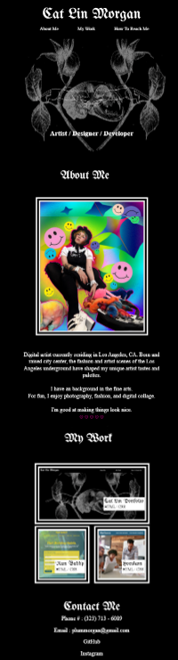
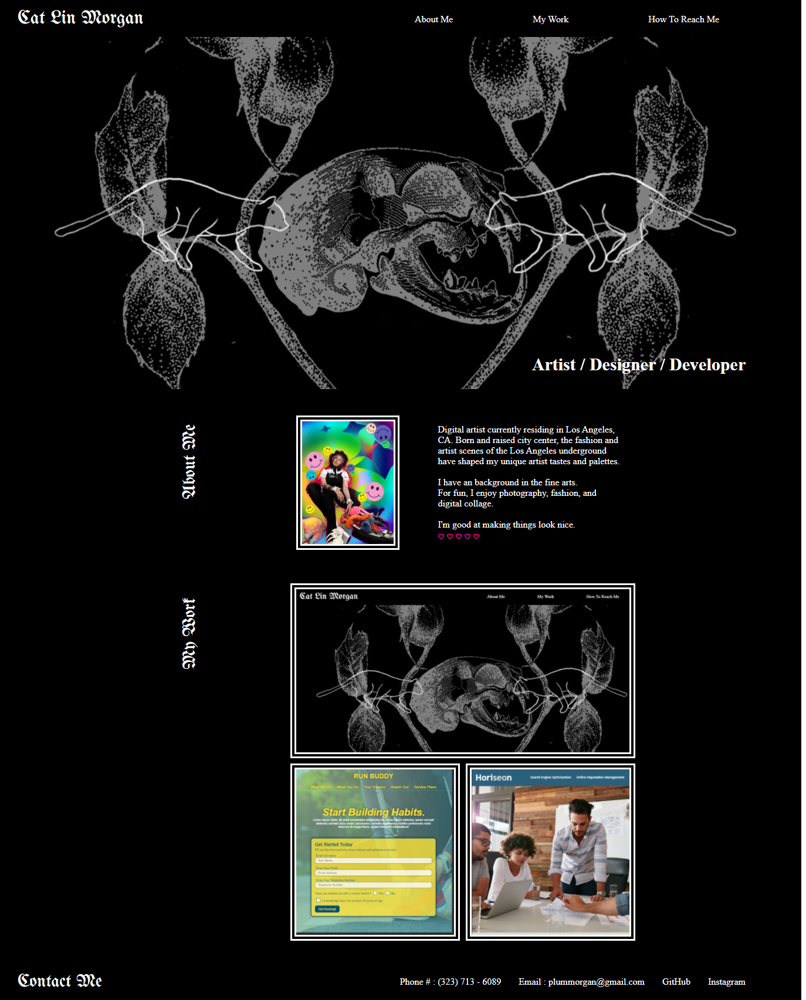

#Welcome to the code for my brand new portfolio!

Here is a direct and working URL to my active website.
https://cat-lin-morgan.github.io/

##Acceptance Criteria

It represents my breath of work and creative tastes.

It is viewable on multiple screen sizes, including smaller screen sizes: 980px, 768px, 575px, and 400px!

Each size has it's own unique layout which flatters each screen size respectively. 

Page is complete with Nav, Sections, and Footer.
Page has my name, contact information, and a recent photograph of me.

All images and GIFs used are owned (or created) by me for me (or my "clients").

All links work and either take you to their respective sections on page or off page, using "target=_blank" to not disrupt your browsing.

The first application in my grid is the biggest and they have all been organized in a way I find visually appealing.

On standard desktop/laptop screens and smaller desktop/laptop screens, my applications have a title on hover. On smaller tablets and iphones the title is always there.

My repo is uniquely named after myself, follows best practices for file structure, naming conventions, class/ids, indentations, and quality commits.

So far my repo has 25 commits and counting, and will continue to be worked on throughout my career. 

Screens shots below. First is my mobile viewport. Second is my laptop viewport, remember that titles appear on hover.

